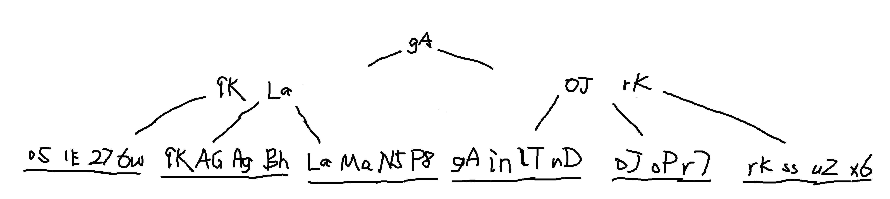

# KV存储实验报告

曾千洋 2018011372

#### 作业用时：10天 4.22~5.2


### 功能实现细节

#### B+树索引

默认为(3,5)-树（M=5），即每个节点最大有4个key。

作为一种内存索引，有利于范围查询。

所有数据索引都保存在叶子结点。



树的搜索`BTree::search`

- 输入key，找到第一个大于或等于key的索引。

树的插入`BTree::insert`

- 搜索key的插入位置。已有key则修改data，否则插入key-data。索引数据插入到叶子结点。
- 解决叶子结点的上溢问题。优先与兄弟结点进行旋转解决上溢，否则分裂解决上溢。
- 叶子结点上溢会上传到父节点，解决内部节点的上溢问题。内部节点通过分裂解决上溢。

树的删除`BTree::remove`

- 搜索key。没有则删除失败，否则删除key-data。
- 解决叶子结点的下溢出问题。优先与兄弟结点进行旋转解决下溢，否则分裂解决下溢。
- 叶子结点下溢会上传到父节点，解决内部节点的下溢问题。内部节点优先通过旋转解决下溢，否则通过分裂解决下溢。

#### 基本功能

get调用B+树的搜索；put调用B+树的插入；remove调用B+树的删除。

put、remove要进行日志的写入。将实际的value写入SSD中的log，内存中的B+树只用记录log中对应的offset作为索引。

log的读写IO操作使用的是`<stdio.h>`中的读写函数，包括`fopen`、`fread`、`fwrite`、`fseek`等。对于长串的读写，采用循环式分步读写的方式完成。单次操作完成后，要保证写入后文件指针及时调用`fclose`，以保证记录能成功持久化。

log采用二进制格式。一行put修改记录的格式：（行不是真的以`'\n'`结尾，只是一种方便的说法。原来是`\n`结尾的但是过不了测试，因为性能测试插入的key含有各种各样的字符，包括`\n`）

```
key.size(8B) value.size(8B) key value
```

一行remove修改记录的格式：

```
key.size(8B) -1(8B) key
```

#### 范围查询

在B+树的基础上，调用搜索接口找到第一个key大于或等于lower的索引，然后顺次访问。由于B+树叶子结点之间都是相连的（叶子结点组成的正是一个链表），因此找到下一个叶子结点是方便的。直到找到第一个key大于或等于upper，访问停止。

#### 崩溃重建索引

Engine启动时会寻找SSD中是否有之前留下来的log文件。若没有则正常启动，否则顺次读取log重建B+树索引。

#### 垃圾回收

采用异步方式进行log的压缩。首先新建一个新log，根据内存索引中的有效数据读取旧log中的一行，写入新log，记下对应的索引。完成新log后，删除旧log，并更新B+树叶子结点中的索引。

#### 多线程安全

采用读写锁的方式保证操作的多线程安全。一个线程申请读锁之后，其他线程可以正常申请读锁，但无法申请写锁（陷入睡眠直到所有读锁释放了之后被唤醒）；一个线程申请写锁后，其他线程无法申请读锁和写锁。

get、范围查询操作申请读锁；put、remove操作申请写锁。重建索引的过程申请写锁。

垃圾回收的过程使用了三把锁。在新建并写入新log时，只是读取旧log和内存索引，因此申请了读锁（保证其他线程不会进行put、remove操作，但可以进行get操作）；接着需要第二把锁，当准备删除旧log、更新内存索引时，垃圾回收线程要申请第二把锁的写锁（保证其他线程也不能执行get操作）；第三把锁用来保证不会有多个线程同时进行垃圾回收，因此是一个简单的互斥锁。


### 思考题

##### 如何保证和验证 Key Value 存储引擎的 Crash Consistency？考虑如下 Crash 情况:

##### a. KV崩溃（进程崩溃）

进程崩溃是软件层面上的崩溃，因此调用系统调用write及时将数据写入内核缓存中即可。可以对进程进行fork来复制一个新进程，通过异步地kill掉老进程，然后继续运行新进程来验证（就像作业的框架代码中所做的那样）。

##### b. 操作系统崩溃

操作系统崩溃的情况下，内核的缓存也不再可靠，因此每次写完数据之后要及时调用fsync系统调用，将数据强制刷新到SSD中。可以使用虚拟机验证操作系统崩溃情况下的一致性。

##### c. 机器掉电

尽可能地保证操作的原子性，使得每个操作不会出现执行一半就因为掉电而停止的情况。可以使用真实机器，对其进行断电进行验证。
